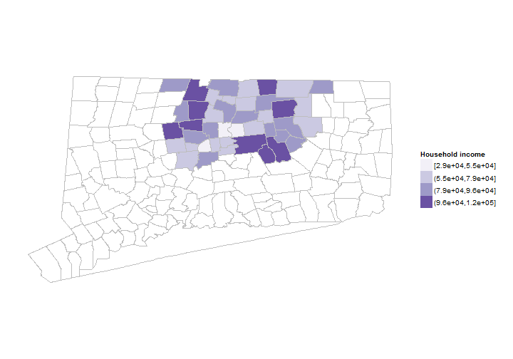
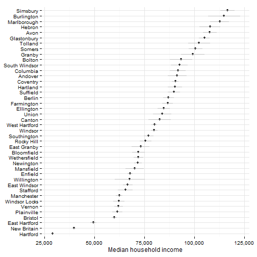

## Household income indicators

This section covers indicators related to the household income of Hartford area residents. 

## Data and limitations

Data on household income typically comes from the U.S. Census Bureau's American Community Survey (ACS). This means that data is available with town or neighborhood-level detail, but only by combining several years of samples (3 to 5), making trend analysis difficult. 

The ACS makes available mean and median income levels. In regions with high-income inequality, very high income levels can skew the mean upwards so most analysis generally uses the median income. Per capita income can be similarly skewed - if there are a small number of high-income individuals, it will raise per capita income levels. 

The ACS does provide several breakouts for income - by age, by whether the individual is employed / unemployed, by nativity (US or foreign-born) - although the margin of error for these subgroups increases the smaller the group. 

## What do we already know?

Household income levels are used in several report; below are references for some. 

### Local

* [Health Equity Index](http://www.cadh.org/health-equity/health-equity-index.html) includes median household income as an indicator of 'Economic Security.'  
* [MetroHartford Alliance's Regional Economic Scorecard](http://www.metrohartford.com/economic-development/regional-data) included real disposable income, drawn from private data sources.
* [Opportunities Hartford](http://www.cahs.org/programs-opportunitieshartford.asp) looks at median income for a family (4-person) and the share of residents with income over the [BEST self-sufficiency measure](http://ctpcsw.com/basic-economic-security-tables/) for the city.
* [Pioneer Valley State of the People](http://pvpc.org/resources/datastats/state-of-people/stateofthepeople2013.pdf) includes median household income as an indicator of 'Economic Security.'
* [CT Voices for Children](http://www.ctvoices.org/) plans to include median household income as an indicator of 'Family Economic Security.'

### Other relevant efforts

* [Boston Indicators Project](http://www.bostonindicators.org/) looks at median household income, with breakouts by race / ethnicity and educational attainment. 
* [The Child Well-Being Index](http://fcd-us.org/our-work/child-well-being-index-cwi) includes median annual income as an indicator of 'Family Economic Well-being.'
* [Chicago Department of Public Health](https://data.cityofchicago.org/Health-Human-Services/hardship-index/792q-4jtu) includes per capita income (total income divided by the total population) as a component of the index.
* [The Rhode Island Community Foundation](http://www.rifoundation.org/CommunityLeadership/CommunityDashboard/tabid/1157/Default.aspx) includes median household income as part of a demographic overview of the state. 
* [The American Human Development Index (HDI)](http://www.measureofamerica.org/human-development/) includes median personal earnings as one factor in the index. 
* [What Matters to Metros](http://www.futurefundneo.org/whatmatters) includes per capita income as a factor, using data from the Bureau of Economic Analysis.

## Sample results

The sample results are for all towns in Hartford and Tolland Counties since it is easier to extract ACS data that way. This can be trimmed to a smaller region later though. 

First are median household income levels by town, mapped for the two counties.

 

Since the data is drawn from the ACS, there are margins of error associated with the values, which can be large for small towns. In practice, this means we cannot effectively distinguish the levels for many towns in the region, especially small towns. 

 

The income data can be looked at by neighborhood (for 5-year estimates); below are maps of income for the region by tract. The more detailed map reveals additional variation; for instance, lower-income areas of West Hartford and Enfield not captured with the town-level data. 

 

Income inequality is a related measure used in some reports. Inequality is typically measured with the [Gini index or coefficient](http://data.worldbank.org/indicator/SI.POV.GINI), which looks at the distribution of income among individuals. If income is shared perfectly equally, the Gini coefficient is 0; if it is completely unequal, the coefficient is 1 (or 100%). 

In Connecticut. the [State Data Center at UConn](http://ctsdc.uconn.edu/dataviz/gini_index_income_inequality_connecticut_towns.html) has created maps of income inequality by town using 2010 census data. 

For the Hartford region, the ACS produces [county](http://factfinder2.census.gov/faces/tableservices/jsf/pages/productview.xhtml?pid=ACS_12_1YR_B19083&prodType=table) and [metro-area]() level estimates for the Gini coefficient. The coefficient for Hartford County is 47% for 2012 and 40% for Tolland County. The Hartford metro area (Hartford, Tolland and Middlesex counties combined, by the census definition) has a 45% coefficient (for [5-year estimates](http://factfinder2.census.gov/faces/tableservices/jsf/pages/productview.xhtml?pid=ACS_11_5YR_B19083&prodType=table)). Fairfield County and the Bridgeport-Stamford metro have the highest levels in the state, but not [the highest nationally](http://www.census.gov/prod/2012pubs/acsbr10-18.pdf). 

For individual towns, values range between 51% for Hartford and 49% in Farmington (indicating higher inequality), to 33% in Marlborough and 36% in Hebron (indicating lower income inequality). Internationally, this puts towns like Marlborough and Hebron in the company of countries like Switzerland (33%) and Italy (36%), and Hartford and Farmington in the company of countries like the Dominican Republic (51%) and Mexico (49%) (looking at [averages for the past decade](http://data.worldbank.org/indicator/SI.POV.GINI)). 
